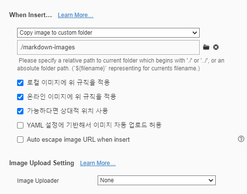

# 마크다운 문법

## 제목

제목은 `#` 로 표현 가능하다. H1 ~ H6 까지  (표현 강조는 `(backtic)으로 감싸기)

### 제목3

#### 제목4

##### 제목5

###### 제목6

* 목록은
* 순서가 없는 목록이 있다.
  * 탭을 통해 목록 수준을 표현할 수 있다.
  * 엔터1
* 엔터2
* 엔터를 통해서 목록수준을 낮출수 있음


1. 순서가 있는 목록도

2. 있다.

   1. 수준도 있고, 엔터를 누루고 *을 하면

   * 섞어서 쓸 수도 있다.


## 코드블록


```python
print('hello!')
# 이것은 주석입니다.
```

```html
<!-- 주석 -->
# 주석 아님
<h1>
    안녕
</h1>
```


## 링크

외부 URL : [google](http://google.com)

특정 파일의 상대경로 : [README](./README.md)

## 이미지



* 위와같이 절대경로로 표현하면, Github등에서 파일이 존재하지 않아

​       존재하지 않아 이미지가 제대로 출력되지 않는다.

* 따라서, typora에 다음과 같은 설정을 해보자.


| 이름   | 나이 | 비고 |
| ------ | ---- | ---- |
| 홍길동 | 300  | x    |
| 김철수 | 10   | x    |
|        |      |      |


## 기타문법

*기울임 이탤릭체*

**굵게 볼드체**

~~취소선~~

`인라인코드블록`

---

